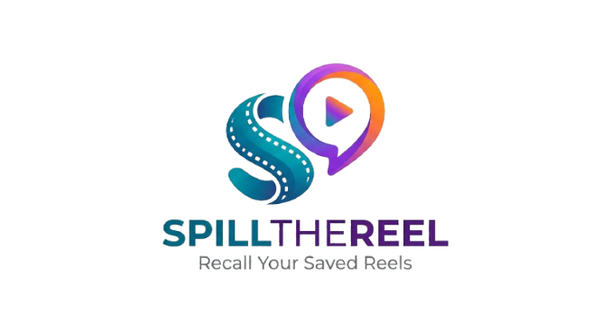
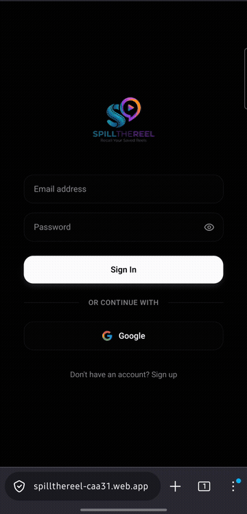
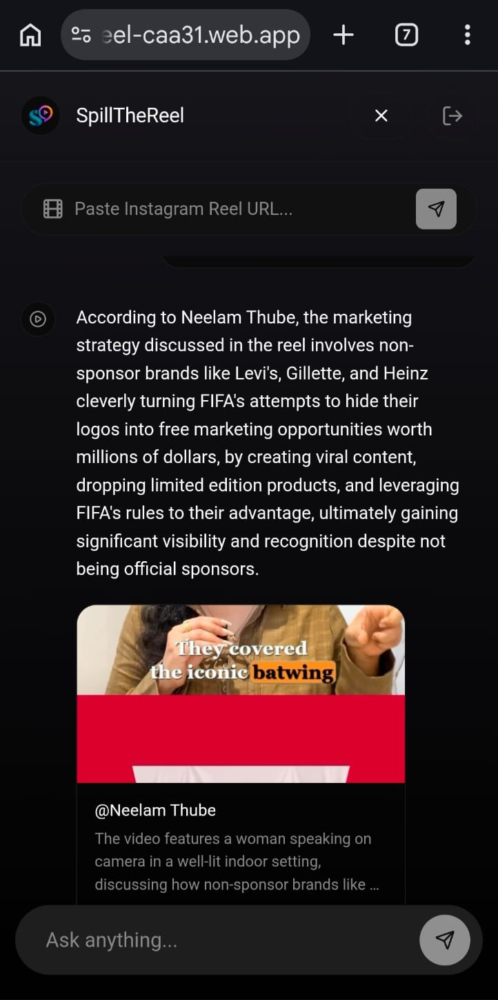
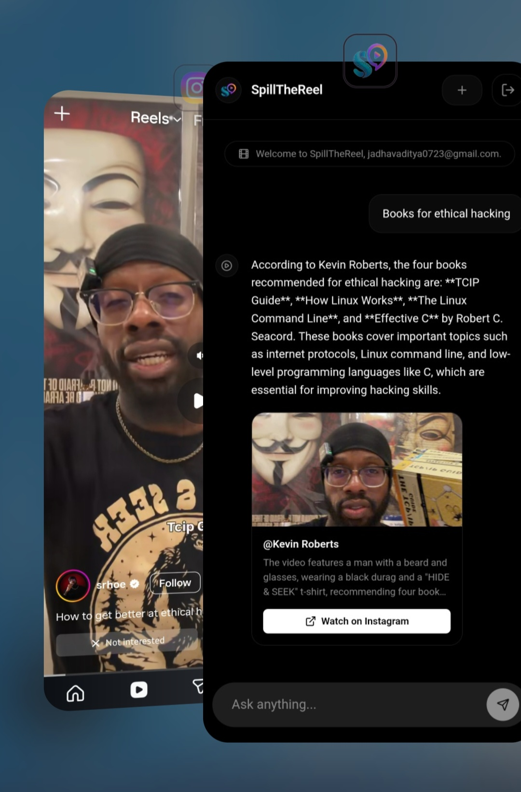
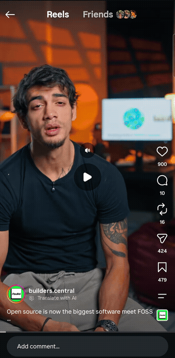

<p align="center">
  
</p>

<h1 align="center">SpillTheReel</h1>

<p align="center">
  <strong>Turn doomscrolling into instant recall</strong>
  <br>
  Share a Reel → AI ingests it → Ask questions about what you've watched
</p>

<p align="center">
  <a href="https://spillthereel-caa31.web.app">🚀 Launch App</a>
  &nbsp;·&nbsp;
  <a href="#features">Features</a>
  &nbsp;·&nbsp;
  <a href="#how-it-works">How It Works</a>
  &nbsp;·&nbsp;
  <a href="#architecture">Architecture</a>
  &nbsp;·&nbsp;
  <a href="#tech-stack">Tech Stack</a>
</p>

---

## Getting Started

<table>
<tr>
<td valign="top" width="50%">

**Step 1:** Go to [spillthereel-caa31.web.app](https://spillthereel-caa31.web.app)

**Step 2:** Tap "Add to Home Screen" to install as a PWA (works like a native app)

**Step 3:** Sign in with Google — then share any Instagram Reel URL

**Step 4:** Ask natural-language questions about your saved reels

✨ Never worry about forgetting a saved reel again  
✓ AI-powered semantic search  

✓ Cognee memory layer for long-term knowledge  

✓ Understands context, not just keywords  

✓ Natural language queries  

✓ Instant recall from thousands of saved reels  

✓ Turns endless scrolling into searchable knowledge

> **Note:** The backend is not yet deployed to a public server. To use SpillTheReel, you'll need to run it locally.

</td>
<td valign="top" width="50%" align="center">
  
</td>
</tr>
</table>


### Local Setup

**Backend (FastAPI):**

```bash
cd backend
python3 -m venv venv && source venv/bin/activate
pip install -r requirements.txt
# Add your API keys to app/.env (see .env.example)
uvicorn app.main:app --host 0.0.0.0 --port 8000
```

**Frontend (Expo web):**

```bash
cd frontend
npm install
npx expo start --web
```

---

## Screenshots

| Ingest a Reel | Search Your Memory | Full Walkthrough |
|:---:|:---:|:---:|
|  |  |  |
| Share a URL, AI extracts everything | Ask questions, get grounded answers | Install → ingest → search in 30s |

---

## Features

- **🧠 AI-Powered Ingestion** — Downloads the reel, transcribes audio (Groq Whisper), extracts visual context (Gemini + Bluesmind), and generates a unified multimodal summary (Groq Llama 3.3)
  
- **🔍 Semantic Search** — Powered by **Cognee Cloud**, which handles vector embeddings, knowledge graph construction, and entity extraction automatically. Your reels become searchable by meaning, not just keywords
  
- **📱 Installable PWA** — Works offline-capable, share sheet integration from Instagram, feels like a native app
  
- **🔒 User Isolation** — Every user's data is scoped to their own Cognee dataset (`reel_knowledge_{uid}`). You only see your own reels
 
- **📊 Graph Storage** — Neo4j AuraDB stores reel metadata with full-text search fallback
  
- **⚡ Real-time Progress** — Polling-based job status so you always know where your reel is in the pipeline

---

## How It Works

```
Instagram URL → POST /ingest
                    │
                    ├─ 1. yt-dlp downloads video
                    ├─ 2. ffmpeg extracts audio → Groq Whisper (transcript)
                    ├─ 3. Gemini 2.0 Flash → Bluesmind mimo-v2.5 (visual analysis)
                    ├─ 4. Groq Llama 3.3 (unified summary)
                    ├─ 5. Cognee Cloud (vector store + knowledge graph + entity extraction)
                    └─ 6. Neo4j AuraDB (reel metadata + full-text search)

Ask a question → GET /chat?q=...
                    │
                    ├─ 1. Cognee Cloud recall (semantic search, scoped to your dataset)
                    ├─ 2. Neo4j full-text fallback (keyword search)
                    └─ 3. Groq Llama 3.3 (natural-language answer)
```


---

## Architecture

| Component | Technology | Role |
|---|---|---|
| **Frontend** | React Native (Expo) + Firebase Hosting | PWA with Google Sign-In, share sheet, real-time polling |
| **Backend** | FastAPI (Python) + Uvicorn | Async REST API, pipeline orchestration, auth |
| **Vector Store + KG** | [Cognee Cloud](https://cognee.ai) | Semantic search, knowledge graph, entity extraction ($37 credits pre-loaded) |
| **Graph DB** | Neo4j AuraDB | Reel metadata, full-text search, user isolation |
| **Transcription** | Groq Whisper | Fast, free speech-to-text |
| **Visual Analysis** | Gemini 2.0 Flash → Bluesmind mimo-v2.5 | Frame-by-frame video understanding |
| **Summary & Chat** | Groq Llama 3.3-70b | Multimodal summary merging + Q&A generation |
| **Auth** | Firebase Admin SDK | Google sign-in, session cookie verification |
| **Tunnel** | Cloudflare Tunnel | Exposes local backend to the internet |

---


## Why Cognee Cloud?

Cognee Cloud is the backbone of SpillTheReel's memory layer:

- **`cognee.remember()`** — Ingests reel summaries and automatically builds a knowledge graph with entity extraction in a single call. No manual pipeline wiring.
- **`cognee.recall()`** — Searches memory with auto-routing: classifies the query and picks the best retrieval strategy (graph completion, semantic, temporal, etc.) automatically.
- **Dataset Isolation** — Each user's reels are stored in `reel_knowledge_{uid}`, scoped exclusively via the `datasets` parameter. Cross-user leakage is impossible.
- **No LLM Ops** — Cognee Cloud handles all LLM calls (embeddings, entity extraction, query completion) internally. No API keys to manage, no litellm timeouts.

---


## Tech Stack

<p align="center">
  
  
  
  
  
  
  
</p>

---

## Future Enhancements

- **Import Instagram Saved Reels** — Import all your Instagram saved reels into SpillTheReel in one click. No need to share URLs one by one — bulk import your entire Instagram saved collection and make it all searchable instantly.


